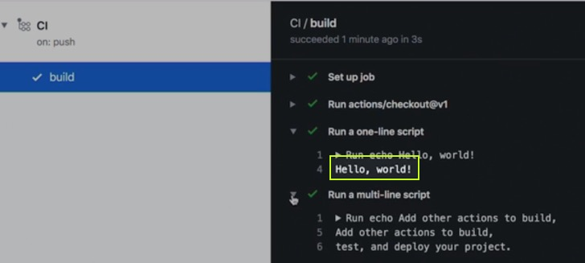

# CI/CD Introduction
<!-- .slide: data-background="images/slides-headline-background.jpg" -->
<!-- s -->

## What is CI/CD

CI/CD means Continous Integration / Continuous Delivery<!-- .element: class="fragment" -->

- CI/CD is a fundamental concept in software development<!-- .element: class="fragment" -->
  - Continuous Integration<!-- .element: class="fragment" -->
  - Continuous Delivery<!-- .element: class="fragment" -->
  - Continuous Deployment<!-- .element: class="fragment" -->

<!-- .element: class="fragment" -->

<!-- s -->

## Continuous Integration

>The practice of automatically building and unit
testing an entire application frequently, ideally on
every source code check-in<!-- .element: class="fragment" -->

<!-- s -->

## Continuous Delivery

>The practice of deploying every build to a
production-like environment and performing
automated integration and acceptance testing<!-- .element: class="fragment" -->

<!-- s -->

## Continuous Deployment

>The practice of automatically deploying every build
to production after it passes its automated tests<!-- .element: class="fragment" -->

<!-- n -->

Generally with CI/CD Continuous Integration / Continuous Delivery is meant. Continuous Delivery and Continuous Deployment are similar and are very often interchanged. 
However the grade of automation if different.
Continuous Delivery means that usually changes are tested/accepted and release to a specific release repository or production like environment whereas Continuous Deployment really means that after automatic testing and acceptance testing it is deployed to the production system and in use. 

<!-- s -->

- automated approaches to produce applications efficiently and reliably
- often described as a pipeline - flow of code and artifacts through build steps
- many CI/CD Tools available
  - [Jenkins](https://www.jenkins.io/)
  - [Bitbucket Pipelines](https://bitbucket.org/product/de/features/pipelines)
  - [GitLab CI/CD pipelines](https://docs.gitlab.com/ee/ci/pipelines/)
  - [GitHub Actions](https://github.com/actions)
  - [Travis CI](https://travis-ci.org/)
  - and many more

<!-- s -->

## Github Actions

- We'll use Github Action because...<!-- .element: class="fragment" -->
  - well, we work on Github <!-- .element: class="fragment" -->
- Github Actions use YAML files <!-- .element: class="fragment" -->
- .yml or .yaml extension<!-- .element: class="fragment" -->

<!-- s -->

## Github Actions

**HELLO WORLD** Example

- Open your repository and goto **Actions**
  
<!-- .element: class="fragment" -->
<!-- s -->

<!-- s -->

- Here we are: 
<!-- .element: class="fragment" -->
<!-- s -->
- Now commit it and look up in action tab how it runs
<!-- .element: class="fragment" -->
<!-- s -->
- Now click the details to see what happens
<!-- .element: class="fragment" -->
<!-- s -->
The output is simply: Hello World!!!

To learn more: 
- [GitHub Actions: Hello World | GitHub Learning Lab](https://lab.github.com/githubtraining/github-actions:-hello-world)

<!-- s -->

## Exercise

- Together with your Group:<!-- .element: class="fragment" -->
  - On your PRJ2 repository activate github actions and let your application(s) BUILD<!-- .element: class="fragment" -->
  - Hint start with Maven Java build template<!-- .element: class="fragment" -->
  - Then adapt it for your needs (e.g. your pom file is located somewhere else -> /implementation)<!-- .element: class="fragment" -->